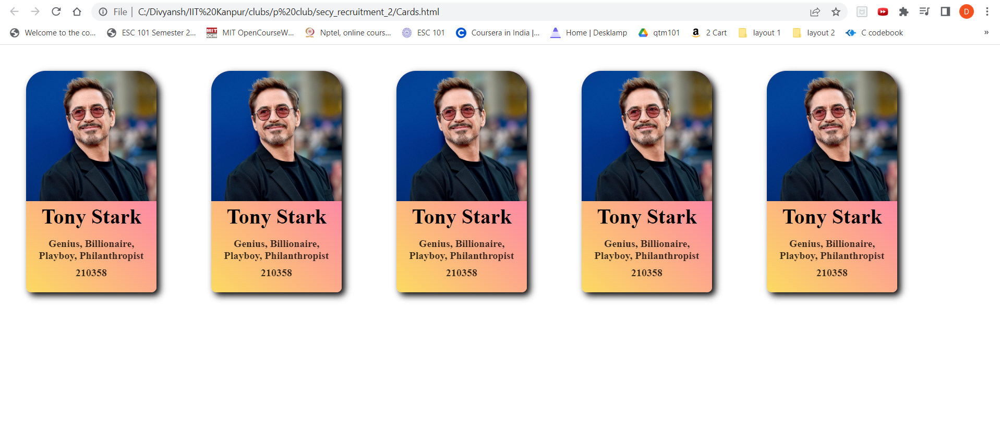
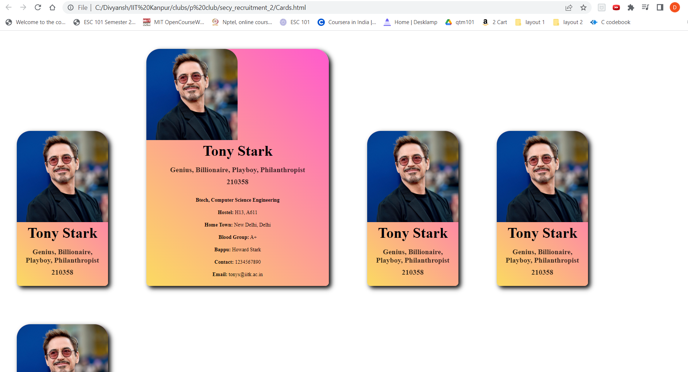

# REVAMP-SEARCH!
Hi I am Divyansh Mittal, and this repository is for Task-1 given by p-club.

**Problem Statement**
>We need you to redesign the Student Search Website( search.pclub.in), the main focus should be on designing the following elements.
---
I have only used HTML/CSS for designing, and the source code for the same is present in Cards.html and Card_style.css.
## NEW DESIGN

**these are multiple user cards displayed, now when we hover our cursor on one of them a personal usercard apears which contains the user's personal data Something like this:**

---
---